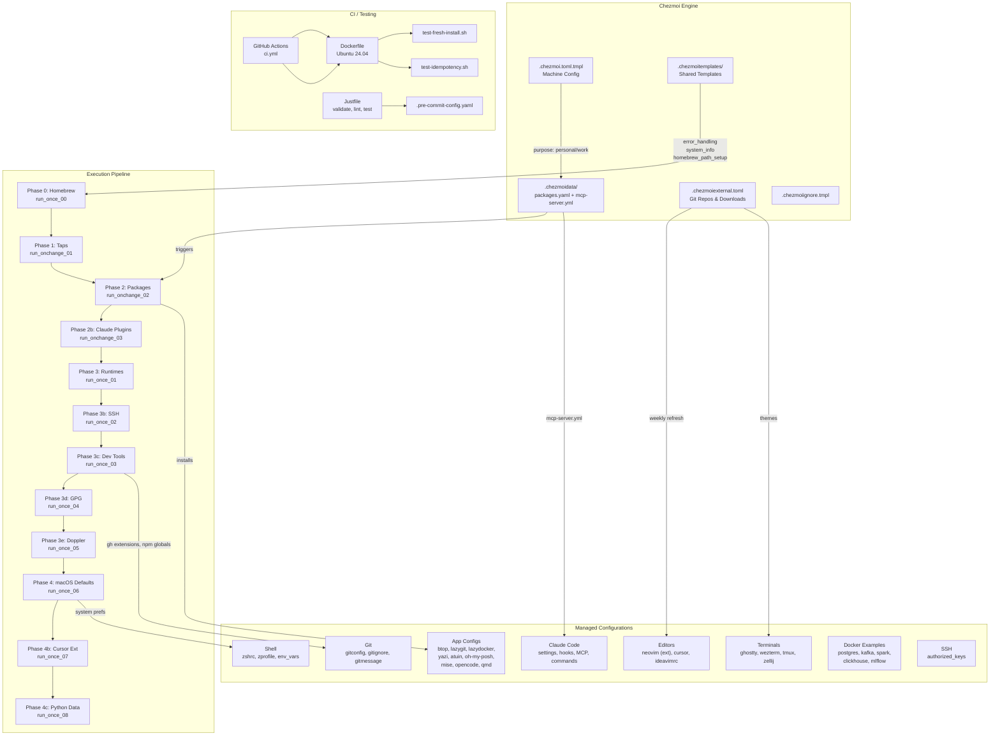
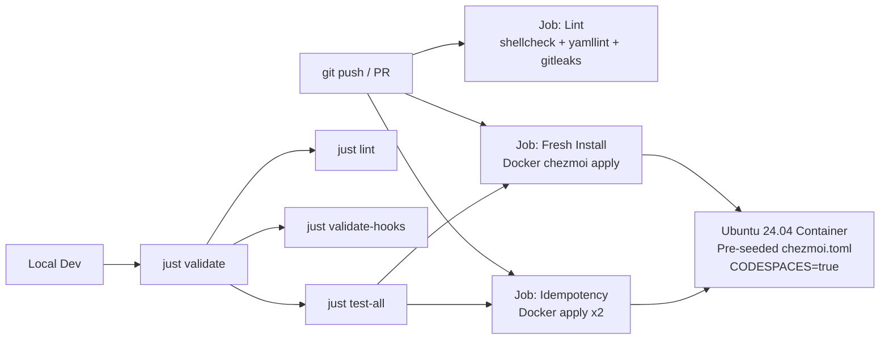

# Architecture

This is a dotfiles repository managed with [chezmoi](https://www.chezmoi.io/), providing reproducible macOS development environment setup with multi-machine support (personal/work).

## High-Level Overview

## Functional Areas

### 1. Chezmoi Core Configuration

| File | Purpose |
|------|---------|
| `.chezmoi.toml.tmpl` | Main config: GPG encryption, git author, machine purpose (personal/work), system detection |
| `.chezmoidata/packages.yaml` | Centralized package definitions organized by category (development, code_quality, terminal, security) |
| `.chezmoidata/mcp-server.yml` | MCP server definitions split by machine purpose (shared/personal/work) |
| `.chezmoiexternal.toml` | External git repos and downloads (neovim config, themes, tmux plugins) with weekly refresh |
| `.chezmoiignore.tmpl` | OS-conditional file exclusion |
| `.chezmoitemplates/` | Shared template fragments: `error_handling`, `system_info`, `homebrew_path_setup` |

### 2. Execution Pipeline (Scripts)

Scripts execute in a deterministic order controlled by chezmoi's `run_once_`, `run_onchange_`, `run_before_`, and `run_after_` prefixes.

**Root-level scripts** (triggered by data changes):

| Script | Trigger | What it does |
|--------|---------|--------------|
| `run_onchange_01_homebrew_taps.sh.tmpl` | packages.yaml changes | Installs Homebrew taps |
| `run_onchange_02_homebrew_packages.sh.tmpl` | packages.yaml changes | Installs all brew/cask packages via dynamic Brewfile |
| `run_onchange_03_install_claude_plugins.sh.tmpl` | mcp-server.yml changes | Installs Claude Code MCP plugins |

**One-time setup scripts** (`.chezmoiscripts/`):

| Script | What it does |
|--------|--------------|
| `run_once_00_install_homebrew.sh.tmpl` | Installs Homebrew (critical prerequisite) |
| `run_once_01_install_language_runtimes.sh.tmpl` | Installs Rust, mise, and language runtimes |
| `run_once_02_setup_github_ssh.sh.tmpl` | Generates and configures GitHub SSH keys |
| `run_once_03_install_development_tools.sh.tmpl` | Installs dev tools: gh extensions, npm globals |
| `run_once_04_setup_gpg_signing.sh.tmpl` | Generates GPG keys and configures git signing |
| `run_once_05_configure_doppler.sh.tmpl` | Configures Doppler secrets management |
| `run_once_06_apply_macos_defaults.sh.tmpl` | Applies macOS system preferences |
| `run_once_07_install_cursor_extensions.sh.tmpl` | Installs Cursor IDE extensions |
| `run_once_08_install_python_data_tools.sh.tmpl` | Installs Python data science tools |

All scripts use Go templates for OS/machine-purpose conditionals and share `error_handling` + `homebrew_path_setup` templates.

### 3. Shell Environment

| File | Target | Purpose |
|------|--------|---------|
| `dot_zshrc.tmpl` | `~/.zshrc` | Main shell config: plugins, aliases, tool integrations (zoxide, direnv, atuin, fzf) |
| `dot_zprofile.tmpl` | `~/.zprofile` | Login shell: PATH setup, environment |
| `dot_zsh_env_vars.tmpl` | `~/.zsh_env_vars` | Environment variables (machine-purpose conditional) |

### 4. Git Configuration

| File | Target | Purpose |
|------|--------|---------|
| `dot_gitconfig.tmpl` | `~/.gitconfig` | 40+ aliases, delta pager, P4Merge tool, GPG signing, conditional email per machine purpose |
| `dot_gitignore_global.tmpl` | `~/.gitignore_global` | Global gitignore patterns |
| `dot_gitmessage.txt` | `~/.gitmessage.txt` | Commit message template |

### 5. Terminal & Editor Configs

| Directory | What |
|-----------|------|
| `dot_config/ghostty/` | Ghostty terminal emulator config |
| `dot_config/wezterm/` | WezTerm: main config, fonts, keys, plugins, themes (Lua) |
| `dot_config/tmux/` | Tmux: main config + statusline (templated for Homebrew path) |
| `dot_config/zellij/` | Zellij: config + default layout |
| `dot_config/yazi/` | Yazi file manager: config, plugins, themes |
| `dot_config/cursor/` | Cursor IDE: settings + keybindings (templated) |
| `dot_cursorrules` | AI coding guidelines for Cursor |
| `dot_ideavimrc` | IdeaVim (JetBrains) config |

### 6. Claude Code Configuration

| File | Purpose |
|------|---------|
| `dot_claude/settings.json.tmpl` | Settings with hooks and permissions (templated per machine) |
| `dot_claude/mcp_servers.json.tmpl` | MCP server config merged from shared + machine-purpose sections |
| `dot_claude/hooks/` | Shell hooks: auto-format, dangerous-guard, file-edit-tracker, session-log |
| `dot_claude/commands/anki.md` | Custom slash command |
| `dot_claude/CLAUDE.md.tmpl` | Per-project Claude instructions |
| `modify_dot_claude.json` | JSON modifier for Claude config |

### 7. Application Configs

| Directory/File | Application |
|----------------|-------------|
| `dot_config/btop/` | System monitor |
| `dot_config/lazygit/` | Git TUI |
| `dot_config/lazydocker/` | Docker TUI |
| `dot_config/atuin/` | Shell history |
| `dot_config/oh-my-posh/` | Prompt themes (5 themes) |
| `dot_config/starship.toml` | Starship prompt |
| `dot_config/mise/` | Runtime version manager |
| `dot_config/opencode/` | OpenCode config |
| `dot_config/qmd/` | Knowledge base search engine |
| `dot_config/mcphub/` | MCP server hub |
| `dot_config/docker-compose-examples/` | Ready-to-use Docker Compose files (5 services) |

### 8. CI & Testing

- **Dockerfile** (`.github/Dockerfile`): Ubuntu 24.04 with pre-seeded config, skips GPG/Doppler/SSH-dependent steps
- **CI pipeline** (`.github/workflows/ci.yml`): 3 parallel jobs on push/PR to main
- **Justfile**: Local task runner for validation, linting, testing, formatting
- **Pre-commit hooks**: shellcheck, yamllint, gitleaks, trailing-whitespace, detect-private-key

## Key Design Decisions

1. **Multi-machine support via `machine.purpose`**: A single `personal` vs `work` toggle controls email, git user, package selection, and MCP server configuration throughout all templates.

2. **Categorized packages**: Rather than a flat list, packages are organized hierarchically in `packages.yaml` (development.version_managers, terminal.file_tools, etc.) and recursively processed during installation.

3. **Two-stage installation**: Prerequisites (Homebrew, taps) run first via `run_onchange_` scripts, then one-time setup scripts handle language runtimes, SSH, GPG, etc.

4. **Shared templates**: Common patterns (error handling, Homebrew path detection, system info) are extracted into `.chezmoitemplates/` and reused across all scripts.

5. **External resource management**: Git repos (neovim config, tmux plugins) and downloaded files (themes) are declared in `.chezmoiexternal.toml` with weekly refresh, keeping them out of this repo.

6. **Docker-based CI**: Tests run in Ubuntu containers with `CODESPACES=true` to bypass macOS-only features, using `--exclude=externals,encrypted` to skip SSH/GPG-dependent resources.
