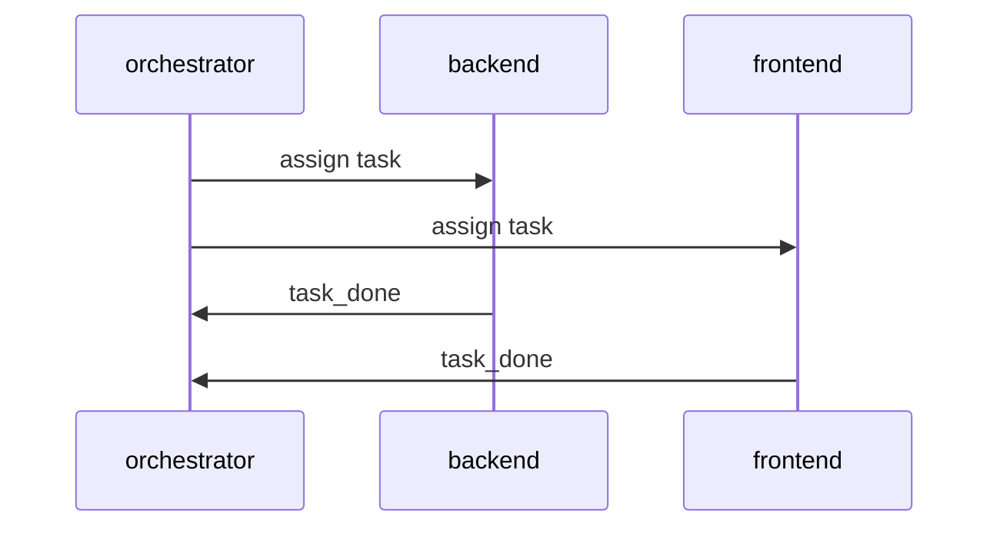

# Deep-execute Init-run Fixture Implementation Plan

> **For agentic workers:** REQUIRED SUB-SKILL: Use superpowers:subagent-driven-development (recommended) or superpowers:executing-plans to implement this plan task-by-task. Steps use checkbox (`- [ ]`) syntax for tracking.

**Goal:** Fixture plan exercising `init-run.sh`'s full `validate-plan.sh --root` gate for the deep-execute test suite.

**Architecture:** Three disjoint worker lanes — backend, frontend, review — plus one orchestrator lane, each owning a distinct path prefix and building against one shared, versioned contract.

**Tech Stack:** Bash, jq, git.

## Global Constraints

- This is a synthetic fixture plan for deep-execute test scaffolding; nothing here describes real production code.

## Clarifying questions

_no ambiguity_

## Ticket and Slack context

- Ticket: none — no related ticket exists
- Slack threads: none found — checked synthetic fixture context

## Requirements matrix

| status | requirement | how the plan satisfies it | verification |
|---|---|---|---|
| ✅ Planned | Initialize lanes from valid plan | Tasks 1-4 materialize contract and lane inputs | init-run test assertions |

## User journey

- Applies: no
- Not applicable: internal fixture has no real user interaction flow

## Data model

- Schema changes: no
- None: fixture uses files only

## Product design handoff prompt

- Needed: no
- Not needed: frontend lane is synthetic and has no real interface

## Overview

## Execution shape

- Mode: `parallel`
- Orchestrator lane: `orchestrator`
- Shared, committed pre-fanout and read-only afterwards: `README.md`
- Ownership syntax: exact repo-relative path, or a directory prefix ending in `/**`; multiple entries separated by ` `

| lane | scope | owns (path globs) | must-not-touch | agent | test_command | mock_command | depends_on |
|---|---|---|---|---|---|---|---|
| orchestrator | Shared contract and README wiring | `contract.schema.json` `README.md` | `backend/**` `frontend/**` `dot_claude/skills/deep-review/**` | `orchestrator` | `true` | `none` | `none` |
| backend | Backend service | `backend/**` | `frontend/**` `dot_claude/skills/deep-review/**` | `opus high` | `true` | `none` | `orchestrator` |
| frontend | Frontend app | `frontend/**` | `backend/**` `dot_claude/skills/deep-review/**` | `sonnet high` | `true` | `none` | `orchestrator` |
| review | Final acceptance checklist | `dot_claude/skills/deep-review/**` | `backend/**` `frontend/**` | `codex gpt-5.6-terra high` | `true` | `none` | `none` |

## API contract

- Contract version: `1.0.0`
- Materialized contract: `contract.schema.json`
- Contract kind: `json-schema`
- Contract validation command: `jq -e '.type' contract.schema.json`
- Endpoints: none — this is a shell-only fixture with no HTTP surface.

## Affected files

- `contract.schema.json` — the materialized contract
- `README.md` — orchestrator docs
- `backend/service.sh` — backend lane entry point
- `frontend/app.sh` — frontend lane entry point
- `dot_claude/skills/deep-review/checklist.sh` — review lane checklist

## TDD test list

- `backend/service.sh` returns normalized rows for a valid input file.
- `frontend/app.sh` renders the normalized rows without error.
- `dot_claude/skills/deep-review/checklist.sh` exits 0 iff every acceptance check passes.
- Mock only the outer network boundary (the fixture registry HTTP client); run backend/frontend/review logic for real.

## Edge cases & failure modes

- Empty input file: `backend/service.sh` must exit non-zero with a clear diagnostic.
- Malformed contract JSON: `frontend/app.sh` must refuse to start.
- Concurrent writes: two lanes must never write the same path.
- Missing acceptance data: `dot_claude/skills/deep-review/checklist.sh` must fail loudly, not silently pass.

## Abstractions decision log

| Decision | Rationale |
|---|---|
| Use a single JSON-schema contract file | Keeps validation dependency-free (just `jq`) |

## Subplans

- [orchestrator](subplans/orchestrator.md)
- [backend](subplans/backend.md)
- [frontend](subplans/frontend.md)
- [review](subplans/review.md)

## Rationale & key decisions

- Four disjoint lanes keep concurrent workers from ever needing to touch the same path.

## Documentation impact

- none — this is a test fixture, no docs describe it.

## QA / test-execution

- QA flag: no — this fixture never runs against a real UI or user flow.
- QA plan: not applicable — fixture has no user-facing flow.

## Implementation tasks

### Task 1: Wire the shared contract and orchestrator harness

**Lane:** `orchestrator`

**Files:**

- Create: `contract.schema.json`
- Modify: `README.md`

**Interfaces:**

- `contract.schema.json` — JSON Schema, `type` required.

- [ ] **Step 1: Write the failing contract test** — assert `jq -e '.type'` on the schema.
- [ ] **Step 2: Run it and verify the red state** — file missing.
- [ ] **Step 3: Create the schema** — minimal valid JSON Schema document.
- [ ] **Step 4: Run it and verify green**.

### Task 2: Implement the backend service

**Lane:** `backend`

**Files:**

- Create: `backend/service.sh`

**Interfaces:**

- `service.sh INPUT.csv` prints normalized rows to stdout.

- [ ] **Step 1: Write the failing service test**.
- [ ] **Step 2: Run it and verify the red state**.
- [ ] **Step 3: Implement `service.sh`**.
- [ ] **Step 4: Run it and verify green**.

### Task 3: Implement the frontend app

**Lane:** `frontend`

**Files:**

- Create: `frontend/app.sh`

**Interfaces:**

- `app.sh` renders normalized rows.

- [ ] **Step 1: Write the failing app test**.
- [ ] **Step 2: Run it and verify the red state**.
- [ ] **Step 3: Implement `app.sh`**.
- [ ] **Step 4: Run it and verify green**.

### Task 4: Implement the review checklist

**Lane:** `review`

**Files:**

- Create: `dot_claude/skills/deep-review/checklist.sh`

**Interfaces:**

- `checklist.sh` exits 0 iff every acceptance check passes.

- [ ] **Step 1: Write the failing checklist test**.
- [ ] **Step 2: Run it and verify the red state**.
- [ ] **Step 3: Implement `checklist.sh`**.
- [ ] **Step 4: Run it and verify green**.

## Superpowers invoked

- [ ] grill-with-docs — not invoked; synthetic fixture plan, no real planning session occurred.
- [ ] brainstorming — not invoked; synthetic fixture plan.
- [ ] writing-plans — not invoked; synthetic fixture plan.

### Handoff (execution phase — run after approval, not required to approve the plan)
- [ ] using-git-worktrees — not invoked; synthetic fixture plan.
