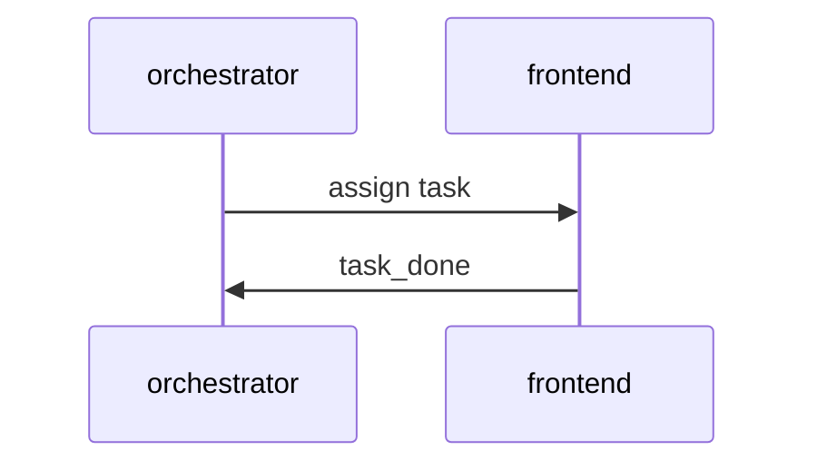

# frontend subplan

```mermaid
sequenceDiagram
  participant O as orchestrator
  participant F as frontend
  O->>F: assign task
  F->>O: task_done
```

## TDD test list

- placeholder test for the frontend lane.
