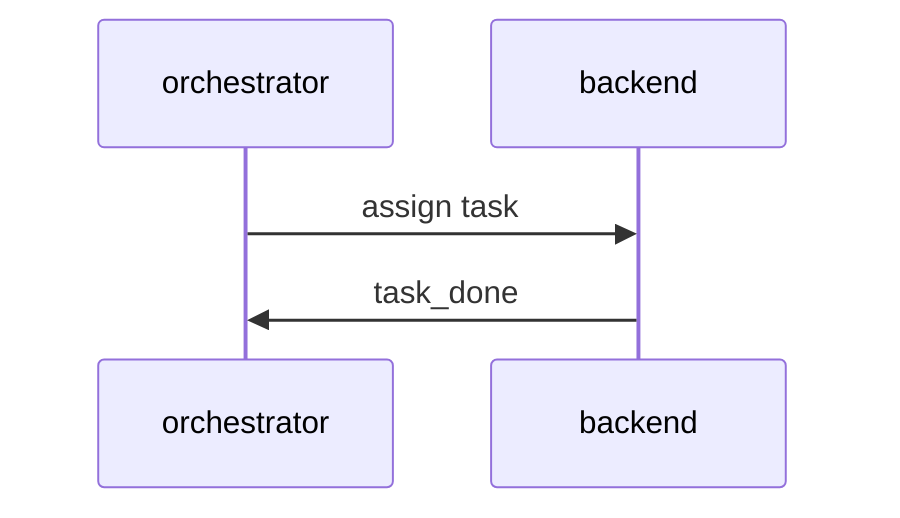

# orchestrator subplan

```mermaid
sequenceDiagram
  participant O as orchestrator
  participant B as backend
  O->>B: assign task
  B->>O: task_done
```

## TDD test list

- placeholder test for the orchestrator lane.
