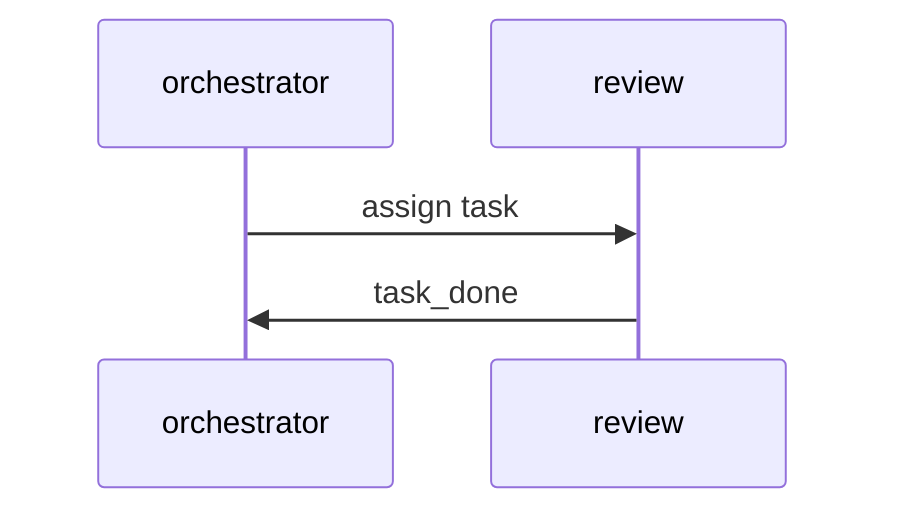

# review subplan

```mermaid
sequenceDiagram
  participant O as orchestrator
  participant R as review
  O->>R: assign task
  R->>O: task_done
```

## TDD test list

- placeholder test for the review lane.
