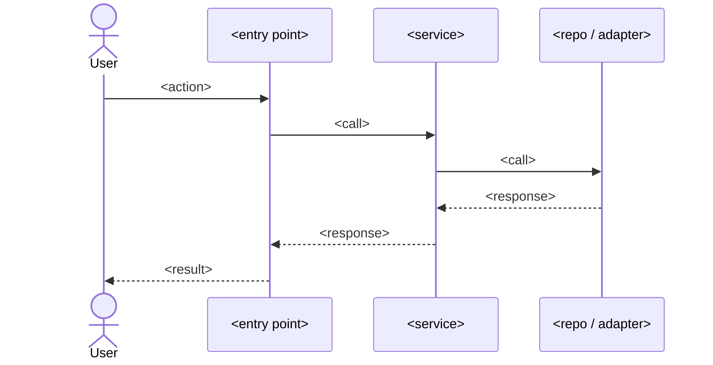

# <title>

## Context
<2-4 sentences: why this change is needed, what prompted it, intended outcome. Include brainstorming insights.>

## Goals
- <verb> <object> — succinct, testable

## Non-goals
- <what this change explicitly does NOT do>

## Clarifying questions
<!--
Every question the AI asked the user before drafting + the answer received.
Use `### Q:` / `### A:` headers. If the task was truly unambiguous, write
exactly the marker `_no ambiguity_` and nothing else in this section.
-->

### Q: <question text>
### A: <user answer>

## Flow diagram

## Affected files
- `path/to/file.ext` — <what changes>
- `path/to/new_file.ext` — <new; purpose>

## Documentation impact
<!-- Logic often lives in docs/ (business rules, flows, ADRs, API specs, runbooks), not only
     in code. List every doc this change makes stale or that must be updated, OR write exactly
     `none — no docs describe this logic` after confirming a search of docs/. -->
- `docs/path/to/doc.md` — <what must change; which rule/flow/endpoint it documents>

## Rationale & key decisions
<!-- The "why" behind the plan — fed by grill-with-docs + brainstorming. This is what
     goes into the PR description. Be objective about what we solve and the trade-offs. -->
- <decision> — <why; alternatives rejected>
- <decision> — <why>

## Abstractions decision log
| Question | Answer | Why |
|----------|--------|-----|
| Adapter/port for vendor primitive? | yes/no | <reason> |
| New module boundary? | yes/no | <reason> |
| Reuse existing utility `X`? | yes/no | <reason> |

## TDD test list
> Mocking policy: mock ONLY the outermost boundaries (network, 3rd-party APIs, clock/random).
> Inner services, repositories, and domain logic run REAL code in tests — do not mock every service.
- `<test name>` — <intent only; no implementation>
- `<test name>` — <intent>
- `<test name>` — <intent>

## Edge cases & failure modes
- Empty / null / zero inputs
- Boundary values (max int, very long strings, unicode/emoji)
- Network/IO failure
- Race condition / concurrent writers

## QA / test-execution
<!-- Does this change user-facing flows or add/alter screens? Answer yes/no.
     If yes, the handoff MUST include `/qa-test-plan` (manual test doc + browser exec). -->
- Changes flows or adds screens? **<yes/no>**
- If yes, QA focus: <which screens/flows a manual tester must exercise>

## Verification
- <command or sequence to validate end-to-end>
- <how to confirm metrics / logs / UX>

## Subplans
<populated by subplan-fanout.sh — one bullet per chapter>

## Grill-with-docs transcript
<!--
Open-ended Q/A from the `grill-with-docs` interview (relentless grilling + ADR/glossary
docs). Use `### Q:` / `### A:` headers. If `--skip-grill` was passed, write exactly
`_skipped_` here.
-->

### Q: <interviewer prompt>
### A: <user response>

## Superpowers invoked
<!-- Planning-phase skills are validated (required). The execution-phase skills run AFTER
     the plan is approved (during the handoff), so they are tracked but not required here. -->
- [ ] grill-with-docs — <when>
- [ ] brainstorming — <when>
- [ ] writing-plans — <when>
- [ ] plannotator-annotate — <when>

### Handoff (execution phase — run after approval, not required to approve the plan)
- [ ] using-git-worktrees
- [ ] subagent-driven-development / executing-plans
- [ ] test-driven-development
- [ ] verification-before-completion
- [ ] finishing-a-development-branch

## Checklist (machine-validated; do NOT hand-edit — call tick-checklist.sh)
- [ ] code-intel-bootstrapped
- [ ] clarifying-questions-asked
- [ ] mermaid-present
- [ ] mermaid-has-entry-and-exit
- [ ] tdd-list-≥3
- [ ] mocking-policy-stated
- [ ] rationale-present
- [ ] docs-impact-listed
- [ ] qa-flag-set
- [ ] adapter-decision-log-≥1-row
- [ ] edges-≥4
- [ ] affected-files-paths-exist
- [ ] subplans-section-non-empty
- [ ] each-subplan-file-exists
- [ ] each-subplan-has-flow-and-tdd
- [ ] no-tbd-placeholders
- [ ] superpowers-all-invoked
