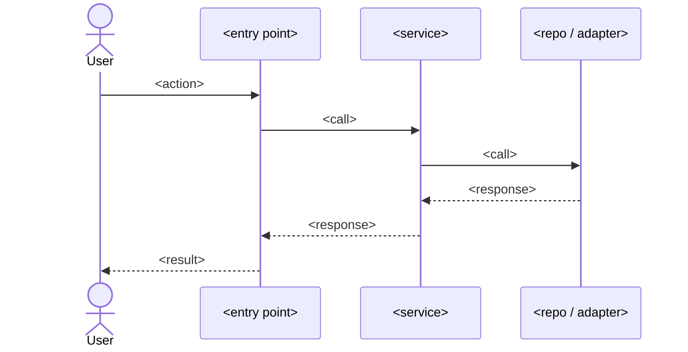

# <Feature Name> Implementation Plan

> **For agentic workers:** REQUIRED SUB-SKILL: Use superpowers:subagent-driven-development (recommended) or superpowers:executing-plans to implement this plan task-by-task. Steps use checkbox (`- [ ]`) syntax for tracking.

**Goal:** <one sentence describing what this builds>

**Architecture:** <2-3 sentences about the approach>

**Tech Stack:** <key technologies / libraries>

## Global Constraints
<!-- Per `superpowers:writing-plans` — fill exactly as that skill specifies. -->
- <constraint>

## Context
<2-4 sentences: why this change is needed, what prompted it, intended outcome. Include brainstorming insights.>

## Ticket and Slack context
<!-- Preserve source links. Never invent a ticket or Slack thread. -->
- Ticket: <URL/key, or `none — no related ticket exists`>
- Slack threads: <one or more URLs with a short relevance note, or `none found — where you checked`>

## Goals
- <verb> <object> — succinct, testable

## Non-goals
- <what this change explicitly does NOT do>

## Requirements matrix
<!-- One row per ticket acceptance criterion or, without a ticket, per concrete user requirement.
     `✅ Planned` means the plan has a concrete implementation + verification mapping; it does
     NOT claim implementation is complete. `/pr-description` later reconciles each row against
     the finished diff/tests and changes status to ✅ Implemented, ⚠️ Partial, or ❌ Missing. -->
| status | requirement | how the plan satisfies it | verification |
|---|---|---|---|
| ✅ Planned | <requirement> | <task/interface/behavior> | <test or observable evidence> |

## User journey
<!-- Use when the change affects a user/operator flow. Preserve meaningful interaction order. -->
- Applies: <yes|no>
1. <actor starts on page/entry point and performs action>
2. <system responds; include alternate/error paths where meaningful>
- Not applicable: <reason, only when Applies is no>

## Data model
<!-- Cover every created or altered table and every affected column. Explain exactly where each
     value comes from. For no schema change, set no and explain why. -->
- Schema changes: <yes|no>
- None: <reason, only when Schema changes is no>

| action | table | column | type | nullable / default | filled from | backfill / lifecycle |
|---|---|---|---|---|---|---|
| <create|alter> | `<table>` | `<column>` | `<type>` | <rule> | <request/event/derived source> | <migration/write/update rule> |

## Product design handoff prompt
<!-- Needed=yes for multiple screens, a new workflow, or a substantial interaction/layout change.
     This is a design-only prompt for claude.design or Codex Product Design. It is NOT an
     implementation task and must not request frontend code. -->
- Needed: <yes|no>
- Not needed: <reason, only when Needed is no>

> Design-only handoff. Do not write implementation code.
>
> Page/screen: <affected page, or screen requirement if new>
>
> Requirements: <user problem, audience, constraints, information hierarchy>
>
> Interactions: <controls, navigation, validation, feedback, keyboard/touch behavior>
>
> Behavior and states: <loading, empty, error, success, permission and edge states>
>
> Responsive/accessibility: <breakpoints, focus order, semantics, contrast, reduced motion>
>
> Deliverable: <design artifact suitable to return for later frontend implementation>

## Clarifying questions
<!--
Every question the AI asked the user before drafting + the answer received.
Use `### Q:` / `### A:` headers. If the task was truly unambiguous, write
exactly the marker `_no ambiguity_` and nothing else in this section.
-->

### Q: <question text>
### A: <user answer>

## Flow diagram

## Affected files
<!-- This is the "File Structure" step of `superpowers:writing-plans` — follow that skill's
     rules for it. One line per file: path — the single responsibility it owns. -->
- `path/to/file.ext` — <what changes; what it is responsible for>
- `path/to/new_file.ext` — <new; single responsibility>

## Execution shape
<!-- Only required when this plan will run through `/deep-execute` in lane-parallel mode.
     For a single work stream, write exactly `- Mode: \`serial\`` and drop the rest of this
     section — `plan-to-json.sh` and the validators treat a missing/serial section as a
     no-op and record `n/a — serial plan`. -->
- Mode: `<parallel|serial>`
- Orchestrator lane: `<lane that commits between rounds>`
- Shared, committed pre-fanout and read-only afterwards: `<path>`, `<path>`
- Ownership syntax: exact repo-relative path, or a directory prefix ending in `/**`; multiple entries separated by ` `

| lane | scope | owns (path globs) | must-not-touch | agent | test_command | mock_command | depends_on |
|---|---|---|---|---|---|---|---|
| `<lane-name>` | <one sentence: what this lane owns> | `<path glob>` `<path glob>` | `<path glob>` `<path glob>` | `<agent from agents.allowlist, or \`orchestrator\`>` | `<test command>` | `<mock command, or \`none\`>` | `<lane name, or \`none\`>` |

## API contract
<!-- Required whenever Mode above is `parallel` — lanes cannot build against a contract
     they have not agreed on. Materialize and commit this file before fan-out. -->
- Contract version: `<MAJOR.MINOR.PATCH>`
- Materialized contract: `<path/to/contract/file>`
- Contract kind: `<openapi|typescript|json-schema|command>`
- Contract validation command: `<command that exits 0 iff the contract is well-formed>`
- Endpoints: see table below — or, if there are none, delete the table and write exactly `Endpoints: none — <why this change has no HTTP endpoint>`

| endpoint | method | full_path | status_codes | request_shape | response_shape |
|---|---|---|---|---|---|
| `<id>` | `<METHOD>` | `<full /path>` | `<comma-separated codes>` | `<shape>` | `<shape>` |

## Documentation impact
<!-- Logic often lives in docs/ (business rules, flows, ADRs, API specs, runbooks), not only
     in code. List every doc this change makes stale or that must be updated, OR write exactly
     `none — no docs describe this logic` after confirming a search of docs/. -->
- `docs/path/to/doc.md` — <what must change; which rule/flow/endpoint it documents>

## Rationale & key decisions
<!-- The "why" behind the plan — fed by grill-with-docs + brainstorming. This is what
     goes into the PR description. Be objective about what we solve and the trade-offs. -->
- <decision> — <why; alternatives rejected>
- <decision> — <why>

## Abstractions decision log
| Question | Answer | Why |
|----------|--------|-----|
| Adapter/port for vendor primitive? | yes/no | <reason> |
| New module boundary? | yes/no | <reason> |
| Reuse existing utility `X`? | yes/no | <reason> |

## Implementation tasks
<!-- DO NOT invent a task format here. Load `superpowers:writing-plans` and follow ITS
     task structure, granularity and no-placeholder rules verbatim — that skill is the
     single source of truth for this section. Fill it with `### Task N:` blocks it defines.
     If `## Execution shape` above declares lanes, tag every task with its owning lane on
     its own line directly under the `### Task N:` title:

     **Lane:** `backend`
-->

## TDD test list
> Mocking policy: mock ONLY the outermost boundaries (network, 3rd-party APIs, clock/random).
> Inner services, repositories, and domain logic run REAL code in tests — do not mock every service.
- `<test name>` — <intent only; no implementation>
- `<test name>` — <intent>
- `<test name>` — <intent>

## Edge cases & failure modes
- Empty / null / zero inputs
- Boundary values (max int, very long strings, unicode/emoji)
- Network/IO failure
- Race condition / concurrent writers

## QA / test-execution
<!-- Does this change user-facing flows or add/alter screens? Answer yes/no.
     If yes, the handoff MUST include `/qa-test-plan` (manual test doc + browser exec). -->
- Changes flows or adds screens? **<yes/no>**
- If yes, QA focus: <which screens/flows a manual tester must exercise>

## Verification
- <command or sequence to validate end-to-end>
- <how to confirm metrics / logs / UX>

## Subplans
<populated by subplan-fanout.sh — one bullet per chapter>

## Grill-with-docs transcript
<!--
Open-ended Q/A from the `grill-with-docs` interview (relentless grilling + ADR/glossary
docs). Use `### Q:` / `### A:` headers. If `--skip-grill` was passed, write exactly
`_skipped_` here.
-->

### Q: <interviewer prompt>
### A: <user response>

## Superpowers invoked
<!-- Planning-phase skills are validated (required). The execution-phase skills run AFTER
     the plan is approved (during the handoff), so they are tracked but not required here.
     Never hand-edit a `[ ]`/`[x]` — call `scripts/superpowers-invoke.sh "$RUN_DIR" <skill>`,
     which records a receipt and ticks the box together.
     To decline a required (planning-phase) skill instead of running it, annotate the line
     with the words `not invoked` — exact wording after that is free-form, e.g.:
     `- [ ] grill-with-docs — not invoked; --skip-grill was passed`
     `- [ ] plannotator-annotate — not invoked as a skill; plannotator CLI unavailable, printed inline` -->
- [ ] grill-with-docs — <when>
- [ ] brainstorming — <when>
- [ ] writing-plans — <when>
- [ ] plannotator-annotate — <when>

### Handoff (execution phase — run after approval, not required to approve the plan)
- [ ] using-git-worktrees
- [ ] subagent-driven-development / executing-plans
- [ ] test-driven-development
- [ ] verification-before-completion
- [ ] finishing-a-development-branch

## Checklist (machine-validated; do NOT hand-edit — call tick-checklist.sh)
- [ ] code-intel-bootstrapped
- [ ] clarifying-questions-asked
- [ ] mermaid-present
- [ ] mermaid-has-entry-and-exit
- [ ] writing-plans-header
- [ ] global-constraints-present
- [ ] tasks-≥1
- [ ] tasks-have-files-and-interfaces
- [ ] tasks-have-tdd-steps
- [ ] tdd-list-≥3
- [ ] mocking-policy-stated
- [ ] rationale-present
- [ ] related-context-present
- [ ] requirements-matrix-present
- [ ] user-journey-documented
- [ ] data-model-documented
- [ ] product-design-handoff-documented
- [ ] docs-impact-listed
- [ ] qa-flag-set
- [ ] adapter-decision-log-≥1-row
- [ ] edges-≥4
- [ ] affected-files-paths-exist
- [ ] subplans-section-non-empty
- [ ] each-subplan-file-exists
- [ ] each-subplan-has-flow-and-tdd
- [ ] no-tbd-placeholders
- [ ] superpowers-all-invoked
- [ ] execution-shape-present
- [ ] exec-mode-valid
- [ ] lanes->=2-if-parallel
- [ ] lanes-own-paths-disjoint
- [ ] affected-files-covered-by-exactly-one-lane
- [ ] lane-agent-in-allowlist
- [ ] lane-test-command-present
- [ ] contract-present-if-parallel
- [ ] contract-endpoints-complete
- [ ] contract-no-placeholders
- [ ] contract-version-present
- [ ] tasks-tagged-with-lane
- [ ] every-lane-has-1-task
- [ ] lane-task-files-subset-of-lane-owns
- [ ] lane-names-unique
- [ ] exactly-one-orchestrator-lane
- [ ] lane-name-grammar-safe
- [ ] depends-on-lanes-known
- [ ] depends-on-no-self
- [ ] depends-on-acyclic
- [ ] superpowers-ticks-have-receipts
