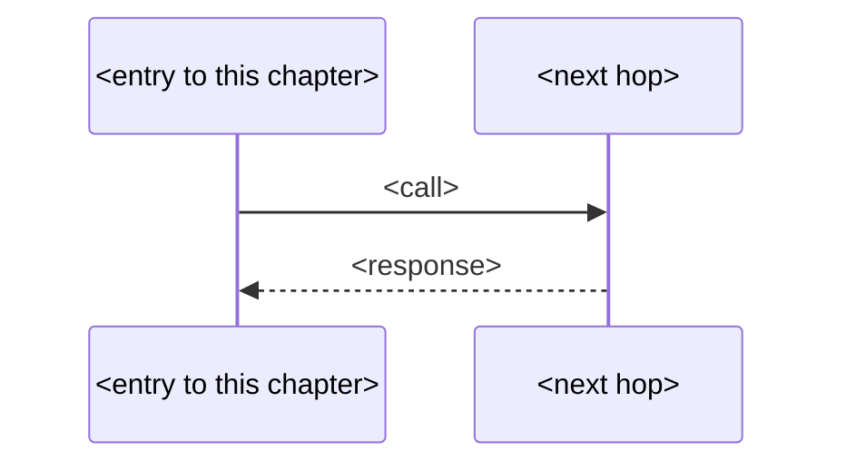

# Subplan: {{CHAPTER}}

## Context
<why this chapter exists; how it slots into the root plan>

## Files in this chapter
{{FILES}}

## Flow diagram

## Implementation tasks
<!-- Load `superpowers:writing-plans` and follow its task structure verbatim — same rules
     as the root plan. Fill with the `### Task N:` blocks that skill defines. -->

## TDD test list
- `<test name>` — <intent>
- `<test name>` — <intent>
- `<test name>` — <intent>

## Edge cases & failure modes
- <bullet>
- <bullet>
- <bullet>
- <bullet>

## Verification
- <how to confirm this chapter works in isolation>

## Checklist (machine-validated; do NOT hand-edit — call tick-checklist.sh --subplan)
- [ ] mermaid-present
- [ ] mermaid-has-entry-and-exit
- [ ] tasks-≥1
- [ ] tasks-have-files-and-interfaces
- [ ] tasks-have-tdd-steps
- [ ] tdd-list-≥3
- [ ] edges-≥4
- [ ] no-tbd-placeholders
