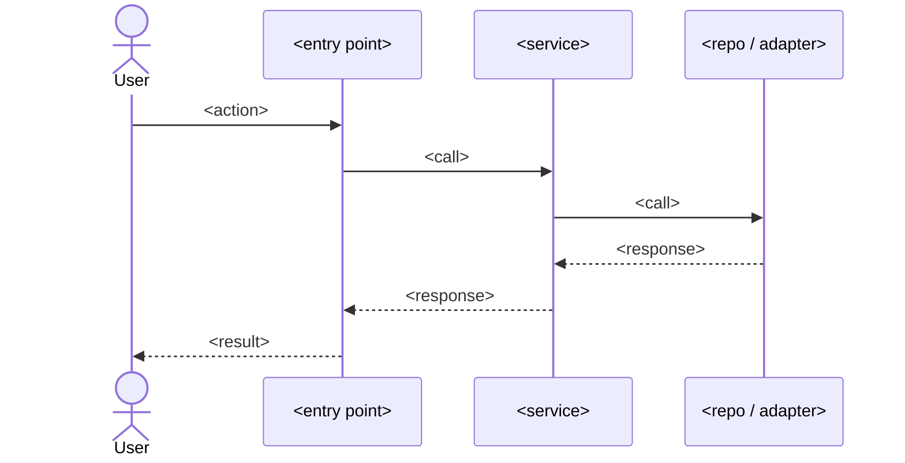

# <title>

## Context
<2-4 sentences: why this change is needed, what prompted it, intended outcome. Include brainstorming insights.>

## Goals
- <verb> <object> — succinct, testable

## Non-goals
- <what this change explicitly does NOT do>

## Clarifying questions
<!--
Every question the AI asked the user before drafting + the answer received.
Use `### Q:` / `### A:` headers. If the task was truly unambiguous, write
exactly the marker `_no ambiguity_` and nothing else in this section.
-->

### Q: <question text>
### A: <user answer>

## Flow diagram

## Affected files
- `path/to/file.ext` — <what changes>
- `path/to/new_file.ext` — <new; purpose>

## Abstractions decision log
| Question | Answer | Why |
|----------|--------|-----|
| Adapter/port for vendor primitive? | yes/no | <reason> |
| New module boundary? | yes/no | <reason> |
| Reuse existing utility `X`? | yes/no | <reason> |

## TDD test list
- `<test name>` — <intent only; no implementation>
- `<test name>` — <intent>
- `<test name>` — <intent>

## Edge cases & failure modes
- Empty / null / zero inputs
- Boundary values (max int, very long strings, unicode/emoji)
- Network/IO failure
- Race condition / concurrent writers

## Verification
- <command or sequence to validate end-to-end>
- <how to confirm metrics / logs / UX>

## Subplans
<populated by subplan-fanout.sh — one bullet per chapter>

## Grill-me transcript
<!--
Open-ended Q/A from the `/grill-me` interview. Use `### Q:` / `### A:`
headers. If `--skip-grill` was passed, write exactly `_skipped_` here.
-->

### Q: <interviewer prompt>
### A: <user response>

## Superpowers invoked
- [ ] brainstorming — <when>
- [ ] writing-plans — <when>
- [ ] test-driven-development — <when>
- [ ] verification-before-completion — <when>
- [ ] grill-me — <when>

## Checklist (machine-validated; do NOT hand-edit — call tick-checklist.sh)
- [ ] code-intel-bootstrapped
- [ ] clarifying-questions-asked
- [ ] mermaid-present
- [ ] mermaid-has-entry-and-exit
- [ ] tdd-list-≥3
- [ ] adapter-decision-log-≥1-row
- [ ] edges-≥4
- [ ] affected-files-paths-exist
- [ ] subplans-section-non-empty
- [ ] each-subplan-file-exists
- [ ] each-subplan-has-flow-and-tdd
- [ ] no-tbd-placeholders
- [ ] superpowers-all-invoked
