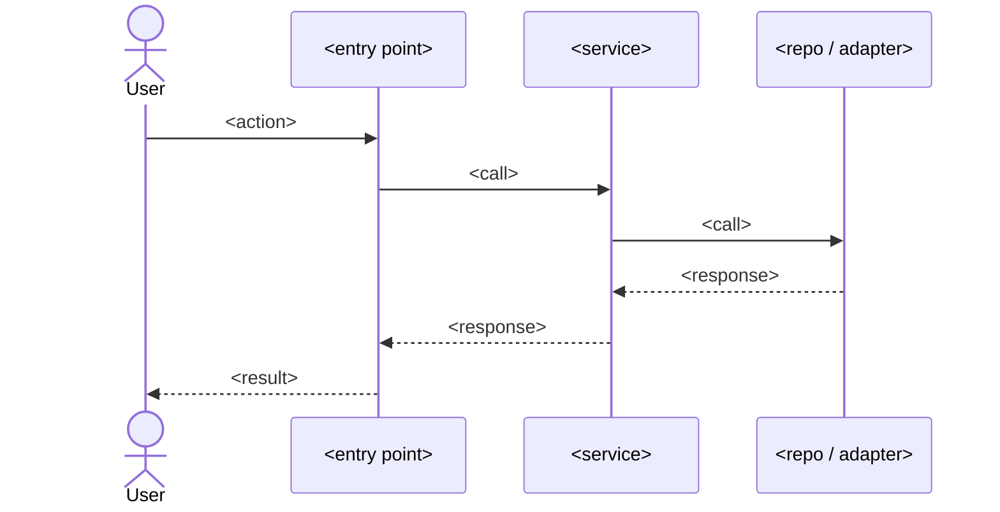

# <title>

## Context
<2-4 sentences: why this change is needed, what prompted it, intended outcome>

## Goals
- <verb> <object> — succinct, testable

## Non-goals
- <what this change explicitly does NOT do>

## Flow diagram

## Affected files
- `path/to/file.ext` — <what changes>
- `path/to/new_file.ext` — <new; purpose>

## Abstractions decision log
| Question | Answer | Why |
|----------|--------|-----|
| Adapter/port for vendor primitive? | yes/no | <reason> |
| New module boundary? | yes/no | <reason> |
| Reuse existing utility `X`? | yes/no | <reason> |

## TDD test list
- `<test name>` — <intent only; no implementation>
- `<test name>` — <intent>

## Edge cases & failure modes
- Empty / null / zero inputs
- Boundary values (max int, very long strings, unicode/emoji)
- Network/IO failure
- Race condition / concurrent writers
- Time/timezone bugs
- Permission/authz bugs
- Retry / idempotency

## Verification
- <command or sequence to validate end-to-end>
- <how to confirm metrics / logs / UX>
